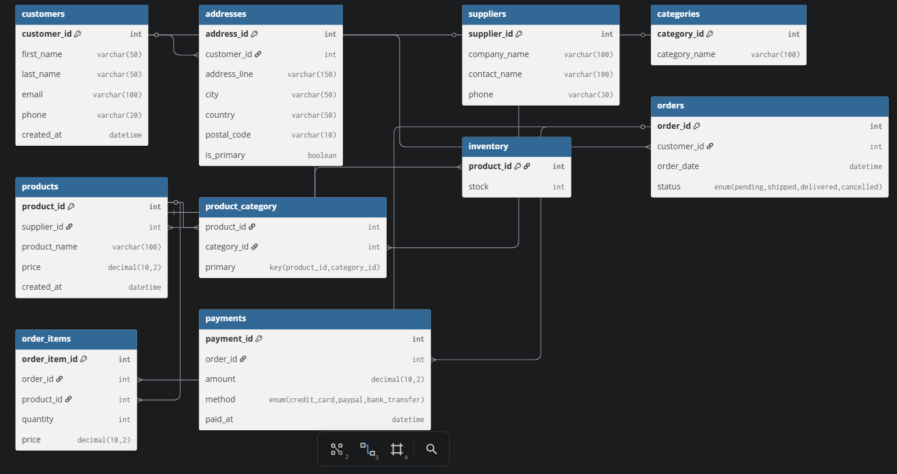

# **DATABASE: `ecommerce_platform`**

A realistic e-commerce database containing:

* **Customers**
* **Addresses**
* **Products**
* **Categories**
* **Product–Category** (many-to-many)
* **Orders**
* **Order Items**
* **Payments**
* **Suppliers**
* **Inventory**



---

# **1. CREATE DATABASE**

```sql
CREATE DATABASE ecommerce_platform;
USE ecommerce_platform;
```

---

# **2. CREATE TABLES**

```sql
-- CUSTOMERS
CREATE TABLE customers (
    customer_id INT AUTO_INCREMENT PRIMARY KEY,
    first_name VARCHAR(50),
    last_name VARCHAR(50),
    email VARCHAR(100) UNIQUE,
    phone VARCHAR(20),
    created_at DATETIME DEFAULT CURRENT_TIMESTAMP
);

-- ADDRESSES (ONE CUSTOMER HAS MANY ADDRESSES)
CREATE TABLE addresses (
    address_id INT AUTO_INCREMENT PRIMARY KEY,
    customer_id INT,
    address_line VARCHAR(150),
    city VARCHAR(50),
    country VARCHAR(50),
    postal_code VARCHAR(10),
    is_primary BOOLEAN DEFAULT 0,
    FOREIGN KEY (customer_id) REFERENCES customers(customer_id)
);

-- SUPPLIERS
CREATE TABLE suppliers (
    supplier_id INT AUTO_INCREMENT PRIMARY KEY,
    company_name VARCHAR(100),
    contact_name VARCHAR(100),
    phone VARCHAR(30)
);

-- CATEGORIES
CREATE TABLE categories (
    category_id INT AUTO_INCREMENT PRIMARY KEY,
    category_name VARCHAR(100)
);

-- PRODUCTS
CREATE TABLE products (
    product_id INT AUTO_INCREMENT PRIMARY KEY,
    supplier_id INT,
    product_name VARCHAR(100),
    price DECIMAL(10,2),
    created_at DATETIME DEFAULT CURRENT_TIMESTAMP,
    FOREIGN KEY (supplier_id) REFERENCES suppliers(supplier_id)
);

-- MANY-TO-MANY: PRODUCT-CATEGORY
CREATE TABLE product_category (
    product_id INT,
    category_id INT,
    PRIMARY KEY(product_id, category_id),
    FOREIGN KEY (product_id) REFERENCES products(product_id),
    FOREIGN KEY (category_id) REFERENCES categories(category_id)
);

-- INVENTORY
CREATE TABLE inventory (
    product_id INT PRIMARY KEY,
    stock INT,
    FOREIGN KEY (product_id) REFERENCES products(product_id)
);

-- ORDERS
CREATE TABLE orders (
    order_id INT AUTO_INCREMENT PRIMARY KEY,
    customer_id INT,
    order_date DATETIME DEFAULT CURRENT_TIMESTAMP,
    status ENUM('pending','shipped','delivered','cancelled') DEFAULT 'pending',
    FOREIGN KEY (customer_id) REFERENCES customers(customer_id)
);

-- ORDER ITEMS
CREATE TABLE order_items (
    order_item_id INT AUTO_INCREMENT PRIMARY KEY,
    order_id INT,
    product_id INT,
    quantity INT,
    price DECIMAL(10,2),
    FOREIGN KEY (order_id) REFERENCES orders(order_id),
    FOREIGN KEY (product_id) REFERENCES products(product_id)
);

-- PAYMENTS
CREATE TABLE payments (
    payment_id INT AUTO_INCREMENT PRIMARY KEY,
    order_id INT,
    amount DECIMAL(10,2),
    method ENUM('credit_card','paypal','bank_transfer'),
    paid_at DATETIME DEFAULT CURRENT_TIMESTAMP,
    FOREIGN KEY (order_id) REFERENCES orders(order_id)
);
```

---

# **3. INSERT data**

```sql
-- CUSTOMERS
INSERT INTO customers(first_name, last_name, email, phone)
VALUES
('Hamza','Lafsioui','hamza@example.com','0612345678'),
('Sara','Amrani','sara@example.com','0623456789'),
('Rachid','Benali','rachid@example.com','0634567891');

-- ADDRESSES
INSERT INTO addresses(customer_id, address_line, city, country, postal_code, is_primary)
VALUES
(1,'123 Main Street','Casablanca','Morocco','20000',1),
(1,'45 Avenue Hassan II','Rabat','Morocco','10000',0),
(2,'12 Rue Marrakech','Marrakech','Morocco','40000',1);

-- SUPPLIERS
INSERT INTO suppliers(company_name, contact_name, phone)
VALUES
('TechWorld', 'Ali Mansouri', '0522123456'),
('HomePlus', 'Nadia El Fassi', '0533445566');

-- CATEGORIES
INSERT INTO categories(category_name)
VALUES ('Electronics'), ('Home Appliances'), ('Smartphones');

-- PRODUCTS
INSERT INTO products(supplier_id, product_name, price)
VALUES
(1,'Laptop Dell XPS',15000),
(1,'iPhone 14',13000),
(2,'Vacuum Cleaner',900);

-- PRODUCT-CATEGORY LINKS
INSERT INTO product_category(product_id, category_id)
VALUES
(1,1), (1,3),
(2,1), (2,3),
(3,2);

-- INVENTORY
INSERT INTO inventory(product_id, stock)
VALUES
(1, 25),(2, 10),(3, 40);

-- ORDERS
INSERT INTO orders(customer_id, status)
VALUES (1,'pending'), (2,'delivered');

-- ORDER ITEMS
INSERT INTO order_items(order_id, product_id, quantity, price)
VALUES
(1,1,1,15000),
(1,2,1,13000),
(2,3,2,900);

-- PAYMENTS
INSERT INTO payments(order_id, amount, method)
VALUES
(2,1800,'credit_card');
```

---

## **INSERT More Data**

```sql
INSERT INTO customers(first_name, last_name, email, phone)
VALUES
('Youssef','Karimi','youssef@example.com','0645678912'),
('Leila','Sadiki','leila@example.com','0656789123'),
('Omar','Chakir','omar@example.com','0667891234'),
('Fatima','Zaidi','fatima@example.com','0678912345');

INSERT INTO addresses(customer_id, address_line, city, country, postal_code, is_primary)
VALUES
(4,'78 Boulevard Zerktouni','Casablanca','Morocco','20050',1),
(5,'23 Rue Fes','Fes','Morocco','30000',1),
(6,'56 Avenue Mohammed V','Tangier','Morocco','90000',1),
(7,'101 Rue Oujda','Oujda','Morocco','60000',1);

INSERT INTO suppliers(company_name, contact_name, phone)
VALUES
('GigaTech', 'Mohamed Idrissi', '0522556677'),
('KitchenPro', 'Samira Othmani', '0533778899');

INSERT INTO categories(category_name)
VALUES
('Laptops'),
('Accessories'),
('Kitchen Appliances');

INSERT INTO products(supplier_id, product_name, price)
VALUES
(3,'Gaming Laptop ASUS ROG',18000),
(3,'Wireless Mouse Logitech',350),
(4,'Blender ProMix',700),
(4,'Microwave HeatMaster',1200);

INSERT INTO product_category(product_id, category_id)
VALUES
(4,1),
(4,4),
(5,1), (5,5),
(6,6),
(7,2), (7,6);

INSERT INTO inventory(product_id, stock)
VALUES
(4,15),(5,100),(6,50),(7,35);

INSERT INTO orders(customer_id, status)
VALUES
(3,'shipped'), (4,'pending'), (5,'delivered'), (6,'cancelled');

INSERT INTO orders (customer_id, status)
VALUES
(1, 'delivered'),
(1, 'pending'),
(1, 'shipped'),
(4, 'delivered'),
(4, 'pending');


INSERT INTO order_items(order_id, product_id, quantity, price)
VALUES
(3,3,1,900),
(3,5,2,350),
(4,1,1,15000),
(5,4,1,18000),
(5,6,1,700),
(6,2,1,13000);

INSERT INTO payments(order_id, amount, method)
VALUES
(3,1600,'paypal'),
(5,18700,'bank_transfer');
```

---

# **4. PRACTICE SQL QUERIES**

##  Beginner

```sql
SELECT * FROM customers;
SELECT product_name, price FROM products;
SELECT * FROM orders WHERE status = 'pending';
```

---

##  Intermediate (JOINs)

```sql
SELECT 
    c.customer_id,
    c.first_name,
    COUNT(*) AS total_orders
FROM customers c
JOIN orders o ON c.customer_id = o.customer_id
GROUP BY c.customer_id, c.first_name;
```

```sql
SELECT 
    c.first_name, 
    o.order_id, 
    o.order_date
FROM customers c
JOIN orders o ON c.customer_id = o.customer_id;
```

---

## Many-to-Many Example

```sql
SELECT 
    p.product_name, 
    c.category_name
FROM products p
JOIN product_category pc ON p.product_id = pc.product_id
JOIN categories c ON pc.category_id = c.category_id;
```

---

##  Subquery Example

```sql
SELECT product_name, price
FROM products
WHERE price > (SELECT AVG(price) FROM products);
```

---

##  Analytics (Aggregations)

```sql
SELECT 
    customer_id, 
    SUM(amount) AS total_spent
FROM payments
GROUP BY customer_id
ORDER BY total_spent DESC;
```

---

##  Window Function (MySQL 8+)

```sql
SELECT
    customer_id,
    order_id,
    ROW_NUMBER() OVER (PARTITION BY customer_id ORDER BY order_date) AS order_rank
FROM orders;
```

---


#  SQL Challenges (A → I)

Each challenge has its own solution file.
Click on a challenge category to view the solution inside the same repository directory.

---

## **A. BASIC SELECT**

 **Solution:** [`basic_select.sql`](basic_select.sql)

1. List all customers ordered alphabetically by last name.
2. Retrieve all products with a price greater than 10,000.
3. Display all orders with status "delivered".
4. Show all categories ordered by category name.
5. List all suppliers in alphabetical order.

---

## **B. JOINS**

 **Solution:** [`joins.sql`](joins.sql)

1. Show each customer and the number of addresses they have.
2. List each order with customer full name and order status.
3. Display all products with their supplier company names.
4. Retrieve all products and their categories (many-to-many).
5. Show all order items with product name and order date.
6. Display each customer and their latest order.
7. Find all products low in stock (stock < 10).
8. List each category and the number of products in it.
9. Show each customer and how much they spent on all orders.
10. Find the top 3 most expensive products with supplier name.

---

## **C. SUBQUERIES**

 **Solution:** [`subqueries.sql`](subqueries.sql)

1. List products costing above the average price.
2. Find customers who placed more orders than the average customer.
3. List orders whose total amount is above average order value.
4. Find products listed in more than one category.
5. Show customers who have never placed an order.

---

## **D. GROUP BY & AGGREGATION**

 **Solution:** [`group_by.sql`](group_by.sql)

1. Find each supplier and number of products they supply.
2. Calculate total revenue per day.
3. Show total number of orders per status.
4. Display customer ID and total quantity purchased.
5. Show product ID and total quantity sold.

---

## **E. WINDOW FUNCTIONS (MySQL 8+)**

 **Solution:** [`window_functions.sql`](window_functions.sql)

1. Rank each customer’s orders by date.
2. Compute running total of payments by date.
3. For each product, show price and difference from average.
4. List each order and show customer’s total spending (window sum).
5. Display customers with their total orders and rolling count.

---

## **F. COMPLEX JOIN + SUBQUERY MIX**

 **Solution:** [`complex_queries.sql`](complex_queries.sql)

1. Retrieve top 5 customers by total spending.
2. Find products never ordered.
3. Show orders with more than one distinct product.
4. Display each product with number of customers who bought it.
5. Show categories where total stock is above 50.

---

## **G. VIEWS**

 **Solution:** [`views.sql`](views.sql)

1. Create a view for order totals; query orders above 20,000.
2. Create a view for products with category names; query electronics.
3. Create a view for inventory with stock status; query "Low".
4. Create a view listing customers who spent more than 10,000.
5. Create a view showing suppliers with total stock value; query top 3.

---

## **H. STORED PROCEDURES**

 **Solution:** [`stored_procedures.sql`](stored_procedures.sql)

1. Procedure: return all orders for a given customer.
2. Procedure: add new product + update inventory.
3. Procedure: return total spending for a customer.
4. Procedure: list products with stock lower than X.
5. Procedure: insert an order + its items using a transaction.

---

## **I. TRIGGERS**

 **Solution:** [`triggers.sql`](triggers.sql)

1. Trigger: decrease inventory when an order_item is inserted.
2. Trigger: log deleted customers into `deleted_customers` table.
3. Trigger: prevent inserting negative stock.
4. Trigger: auto-set order status to “delivered” after full payment.
5. Trigger: save price changes in `price_history` table.

---


